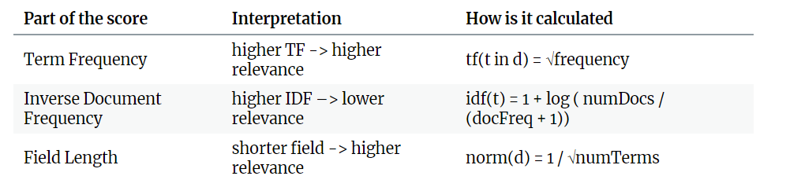

### Introduction. 

This is to build an efficient search engine that performs search on Wikipedia pages. This projects creates inverted index creation and query search mechanism. After creating the index, user may enter search term and the console application shall return the list of most relevant pages pertaining to the search.

The data are found on: `https://dumps.wikimedia.org/enwiki/20230920/`

This application will consist of:
1) XML parsing
2) Case folding
3) Stop word removal
4) Lemmatization
5) inverted index creation
6) Optimization

### How does this local search engine rank the page?
This search engine works on tf-idf score.

tf-idf score = tf * idf * norm(d)

### Starting the application
1) `python -m venv .venv`
2) `.\.venv\Scripts\activate` and then `pip install -r requirements.txt` in a new environment
3) `python index_creator.py /data_path` wait for index to generate
4) `python query.py SEARCH_TERM`
5) indices and pages directory will be created when index_creator.py finish running. These are indexes that will be used to generate the relevant articles
